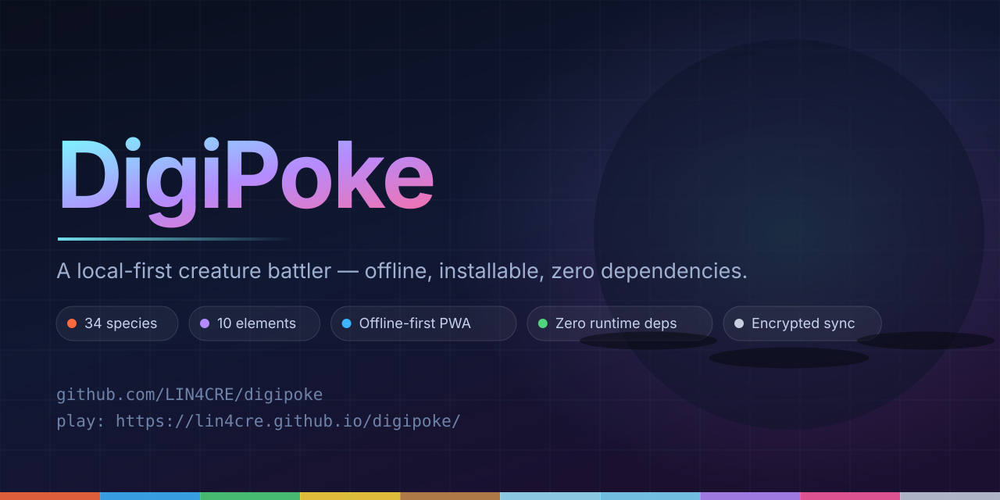

<div align="center">
  

  <p>
    <a href="https://github.com/LIN4CRE/digipoke/actions/workflows/ci.yml"></a>
    <a href="https://github.com/LIN4CRE/digipoke/actions/workflows/pages.yml"></a>
    <a href="https://github.com/LIN4CRE/digipoke/blob/main/tests/"></a>
    <a href="https://github.com/LIN4CRE/digipoke/blob/main/LICENSE"></a>
    
  </p>

  <p><b>▶ <a href="https://lin4cre.github.io/digipoke/">Play it in your browser</a></b> — no install, no account, works offline after the first load.</p>
</div>

## DigiPoke

**A local-first creature-collecting battler.** Raise, battle and evolve digital life —
entirely on your device. Installable PWA, works offline, zero runtime dependencies,
with optional end-to-end encrypted sync that the server cannot read.

> Mix between Digimon and Pokémon: Digimon-style evolution ladders and bonding,
> Pokémon-style catching and elemental combat — minus the always-online account.

---

## Quickstart

```bash
# 1. Run everything (PWA on :8080, sync API on :4000)
npm start

# 2. Open the app
open http://localhost:8080/

# 3. Verify it (40 tests: engine, API, and real headless browser journeys)
npm test

# 4. Static checks (imports, precache, placeholders, external URLs)
npm run lint
```

There is **no build step and nothing to install to run the app** — `apps/web/` is the
artefact. `npm install` is only needed for the *test-only* tools (jsdom, fake-indexeddb);
without them the UI test suite skips itself and everything else still runs.

---

## The opening (splash → Tamer → partner → Nexus)

The first two minutes are hand-built, in five steps:

1. **Splash** — animated starfield and light shaft, the three starters named on
   their pedestals, `Press Start` (also the gesture that unlocks the audio
   context). The button is focused on load, so Enter starts the game.
2. **Identity** — name entry with a live character counter, a passphrase with a
   strength meter, an ID card whose Tamer ID is derived from the name as you
   type, and a checklist that ticks itself off (so a disabled `Continue` is
   never a mystery). Enter walks the form.
3. **Appearance** — a procedural portrait with 6 option groups
   (~98,000 combinations) on a lit pedestal. Hovering or focusing an option
   previews it without committing; choosing one fires sparks and keeps focus
   where it was. Arrow keys move within a group, *Surprise me* re-rolls.
4. **Partner** — three cards with a one-word playstyle tag, plus a dossier with
   lore, stats that show the level-50 ceiling, starting moves and upcoming ones.
5. **Launch** — a "Digitising…" cinematic with a real progress readout, a scan
   line over your Tamer, and tap-or-Enter to skip. It then hands off to the
   Nexus, where a primer and a highlighted **Start here** tile tell you exactly
   what to do first.

Every piece of art (34 creatures, NPCs, the Tamer) is generated as SVG from code,
and every sound is synthesised at runtime — no image or audio files anywhere,
so the whole game stays ~400 KB and works offline.

---

## What's inside

| Area | Detail |
|---|---|
| **Species** | 34 across 10 evolution lines (rookie → champion → ultimate) + 4 bond-gated Mega forms |
| **Combat** | 10 elements (0×–4×), 33 moves, 5 status conditions, stat stages, crits, STAB, priority tiers |
| **Progression** | Levels 1–50, bond, cores (IVs 0–15), Data Shards, daily objectives, 6 zones |
| **Collection** | 3 ball types with live catch probability, Glitch (shiny) variants at 1/512, ranch + team management |
| **Lab** | Evolution, core training, move tutoring, shard fabricator |
| **Data** | Plain + encrypted export/import, 5 rolling backups, storage stats, one-click wipe |
| **Sync** | Optional, opt-in, zero-knowledge (AES-256-GCM sealed before upload) |
| **Audio** | ~50 synthesised cues + 5 adaptive music tracks (menu, explore, lab, battle, victory) on a lookahead scheduler |
| **Feedback** | Chip-damage HP bars, floating numbers (crit/super/resist/heal/MISS), impact shake, capture wobbles |
| **PWA** | Installable, offline after first load, 4 themes, reduced-motion support |

---

## Scripts

| Command | What it does |
|---|---|
| `npm start` | PWA on `:8080` + sync API on `:4000` |
| `npm run dev` | PWA only |
| `npm test` | 40 tests (domain, API, headless-browser journeys) |
| `npm run lint` | Import resolution, precache list, placeholders, external URLs, **CSS class coverage** |
| `npm run art` | Regenerate `previews/gallery.html` (every creature, Tamer avatars, expressions) |
| `npm run banner` | Regenerate `.github/assets/banner.{svg,png}` from the shipped renderers |
| `npm run playtest` | Walk the opening flow like a new player and report polish gaps (audio, focus, feedback) |
| `npm run build:single` | Bundle everything into one self-contained `dist/digipoke.html` |
| `npm run verify:single` | Boot-test that single file (replays its module loader in Node) |
| `npm run tunnel` | Publish the local PWA at a public `https://….lhr.life` URL (no account) |
| `npm run publish:github` | Create the GitHub repo and push (reads `GITHUB_TOKEN` from env, never from disk) |
| `npm run deploy` | Publish to GitHub Pages from the `gh-pages` branch — no CI or runner required |

---

## Architecture at a glance

```
apps/web/          the PWA — vanilla ES modules, no framework, no build step
  src/core/        infrastructure: state, IndexedDB, crypto, router, RNG, audio, bus
  src/domain/      pure game rules (no DOM, no IO): battle engine, species, creatures
  src/ui/          presentation: dom helpers, procedural SVG sprites, components, 7 screens
  src/sync/        optional zero-knowledge sync client
server/            optional sync API — Node standard library only, zero dependencies
tools/             dev server, process runner, dependency-free linter
tests/             domain (18) · API (12) · UI/jsdom (9) = 39 tests
docs/              PRD, architecture, data model + SQL, API spec, security, plan
```

**Dependency rules:** `domain/` imports nothing from `ui/` or `core/state`; the UI never
mutates state directly (all writes go through named actions in `core/state.js`);
`core/state.js` is the only module that touches IndexedDB; deleting `sync/` removes cloud
features and breaks nothing else.

**Determinism:** every random outcome flows through one seeded PRNG (mulberry32), so a
save plus a seed reproduces a battle exactly. That is what makes the 400-battle fuzz
test possible — it runs in ~113 ms with no browser.

---

## Engineering documentation

| Document | Contents |
|---|---|
| [`docs/01-PRD.md`](docs/01-PRD.md) | Personas, journeys, functional + non-functional requirements, MVP scope |
| [`docs/02-architecture.md`](docs/02-architecture.md) | Folder tree, module boundaries, dependency manifest, ADRs, data flow, budgets |
| [`docs/03-data-model.md`](docs/03-data-model.md) | Save-file schema, IndexedDB stores, entity model, migrations |
| [`docs/03-schema.sql`](docs/03-schema.sql) | Reference PostgreSQL schema (SQLite/MySQL notes included) |
| [`docs/04-api-spec.md`](docs/04-api-spec.md) | HTTP endpoints, request/response, state contract, component hierarchy |
| [`docs/05-security-and-quality.md`](docs/05-security-and-quality.md) | Threat model, crypto, validation, access control, testing strategy |
| [`docs/06-implementation-plan.md`](docs/06-implementation-plan.md) | Phase 0 → 3 task breakdown with acceptance criteria and estimates |

---

## Configuration

**Client** (Settings screen, stored locally):

| Setting | Default | Notes |
|---|---|---|
| Theme | `nexus` | Also: `ember`, `abyss`, `mono` |
| Animations / Sound / Autosave | on | Reduced-motion OS setting is honoured automatically |
| Server URL | auto-derived | Falls back to `http://localhost:4000/v1` |

**Server** (environment variables):

| Variable | Default | Purpose |
|---|---|---|
| `PORT` | `4000` | HTTP port |
| `HOST` | `0.0.0.0` | Bind address |
| `DIGIPOKE_ORIGIN` | `*` | CORS allowlist (restrict in production) |
| `DIGIPOKE_DATA_DIR` | `./data` | Where `store.json` lives |
| `DIGIPOKE_RATE_MAX` | `10` | Auth attempts per minute per IP |
| `DIGIPOKE_RATE_MS` | `60000` | Rate-limit window |

---

## Deploying

**Two GitHub Pages paths, one result.** `npm run deploy` publishes from the
`gh-pages` branch and needs no runner, so it works even where GitHub Actions
does not. `.github/workflows/pages.yml` is the same deployment as a workflow
for accounts with Actions enabled (repo Settings → Actions → enable): it runs
lint + tests first, then deploys `apps/web/`. Point Pages at whichever you
prefer (Settings → Pages → Build and deployment → Source).

```bash
# PWA — upload apps/web/ to any static host. Serve over HTTPS (required for service
# workers). No build, no bundler, no pipeline.

# …or ship a single file: everything inlined, opens from disk, drops on any host
npm run build:single     # → dist/digipoke.html
npm run verify:single    # boots it headlessly and plays the first two steps

# …or share your dev machine for a playtest, no account and no signup:
npm run dev &            # PWA on :8080
npm run tunnel           # prints https://<id>.lhr.life

# …or let GitHub Pages host it permanently (free, HTTPS, no tunnel churn):
export GITHUB_TOKEN=ghp_…   # or rely on your existing git credentials
npm run deploy              # builds, commits apps/web to gh-pages, pushes
# Live at https://<you>.github.io/digipoke/ within ~30s — no CI involved

# …or set up the repository and push it in one step:
npm run publish:github -- --pages

# Sync API (optional)
PORT=4000 DIGIPOKE_ORIGIN=https://digipoke.example.com node server/src/server.js
# Put it behind an HTTPS reverse proxy and back up data/store.json.
```

When you change any shell asset, bump `CACHE_VERSION` in `apps/web/sw.js`.

---

## Repository layout on GitHub

| Path | Purpose |
|---|---|
| `.github/workflows/ci.yml` | Lint + 40 tests + single-file build on every push and PR (Node 20 & 22) |
| `.github/workflows/pages.yml` | Deploys `apps/web/` to GitHub Pages, gated on the same checks (needs Actions enabled) |
| `.github/assets/banner.{svg,png}` | Repository banner, rendered by `npm run banner` from the shipped art code |
| `tools/publish-github.mjs` | Creates/reuses the repo, pushes, optionally enables Pages |
| `LICENSE` | MIT |

`npm run publish:github` takes the token from the `GITHUB_TOKEN` environment
variable only — never an argument (shell history leaks), never a file, never
committed, and it rewrites the git remote back to a clean URL after pushing so
no credential is left in `.git/config`.

---

## Security in one paragraph

Your save is encrypted in your browser with AES-256-GCM, using a key derived from your
passphrase with PBKDF2 (250 000 iterations). The sync server stores only the ciphertext
plus a scrypt hash of your password for authentication — two different KDFs, so the
server can verify you but can never decrypt your data. Losing the passphrase means
losing encrypted backups: there is deliberately no reset path, because a reset path
would require the server to hold a key.

Full details: [`docs/05-security-and-quality.md`](docs/05-security-and-quality.md).

---

## Browser support

Evergreen Chrome, Edge, Firefox and Safari (iOS 16.4+ for standalone install mode).
Requires IndexedDB and Web Crypto (i.e. a secure context: HTTPS or localhost).

---

## Licence

MIT.
